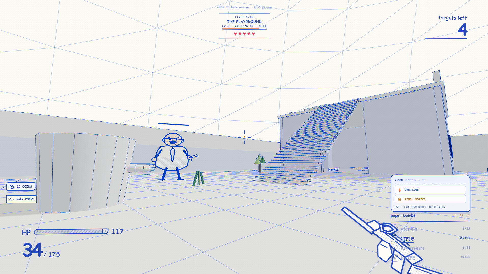
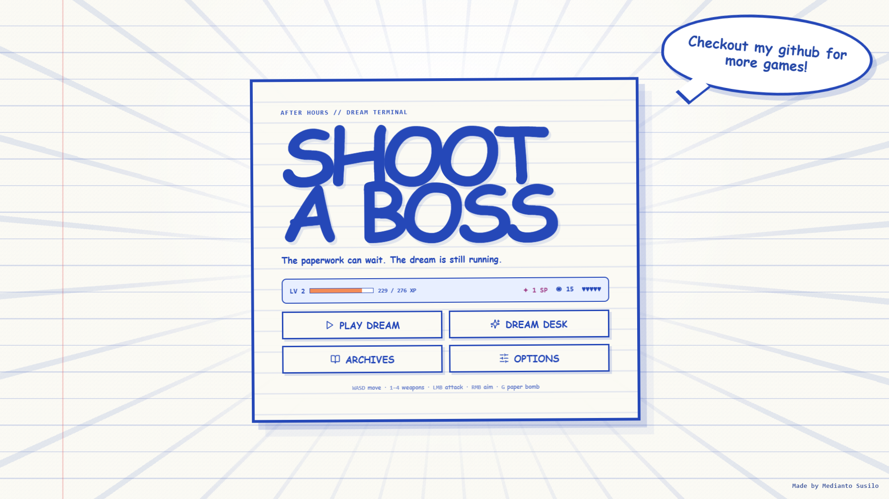
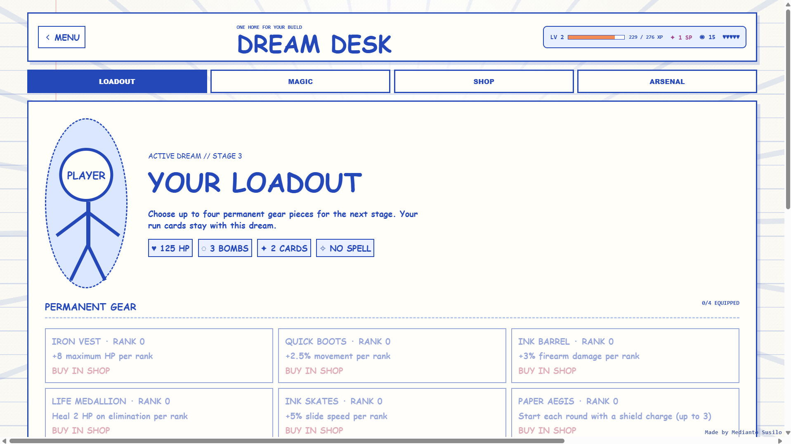

# Shoot a Boss

**Shoot a Boss** is a browser FPS game I built with React, TypeScript, Three.js, and Rapier.

The idea is pretty simple: an exhausted office worker falls asleep at their desk and gets thrown into a weird notebook-style dream where all the stress from work turns into enemies, hazards, paperwork monsters, and bosses.

The whole game uses a hand-drawn white-paper / blue-ink style, so instead of trying to look realistic, it leans into the feeling of playing inside a messy notebook.

**Live build:** https://shoot-a-boss.vercel.app

## Screenshots

<p align="center">
  
</p>

<table>
  <tr>
    <td width="50%" align="center">
      
      <br />
      <sub><b>Main Menu</b></sub>
    </td>
    <td width="50%" align="center">
      
      <br />
      <sub><b>Dream Desk</b></sub>
    </td>
  </tr>
</table>


## About the game

The game is structured around a 10-stage campaign. Each stage gets harder, introduces different enemy combinations, and rotates through different map themes with their own hazards and movement challenges.

During a run, you can build your character through Dream Cards, Magic, Gear, and weapon-specific upgrades. Some cards can also combine into Evolutions, so later stages can feel very different depending on what kind of build you ended up making.

There is also permanent progression outside the run, including player levels, skill points, gear, magic upgrades, cosmetics, and unlocked stages.

I wanted the game to feel fast and arcade-like, but still give the player enough systems to experiment with different playstyles instead of just shooting the same enemies over and over.

## Main systems

The current version includes:

- 4 weapons: Sniper, Rifle, Shotgun, and Knife
- 10 campaign stages across Playground, Jungle, Gem, and Hell maps
- run-based Dream Cards and card Evolutions
- permanent Gear and elemental Magic progression
- XP, player levels, Skill Points, Coins, Hearts, Dream Anchors, and NG+
- enemy scanning, pickups, grenades, hazards, and stage events
- cosmetic weapon skins, crates, and an Arsenal
- Practice mode for completed stages
- local save data with migration support
- desktop and touch/mobile controls

The menus are organized around:

- **Play Dream** — campaign and Practice stages
- **Dream Desk** — Loadout, Magic, Shop, and Arsenal
- **Archives** — story and Bestiary
- **Options** — controls, audio, fullscreen, tutorials, and save reset

## Controls

| Input | Action |
| --- | --- |
| WASD | Move |
| Shift | Sprint |
| Space | Jump / climb |
| C | Crouch / slide |
| 1–4 / Mouse Wheel | Switch weapon |
| Left Mouse | Shoot / attack |
| Right Mouse | Aim |
| R | Reload |
| G | Throw Paper Bomb |
| Q | Mark enemies |
| F | Cast Magic |
| E / Shift+E | Use Jungle ziplines |
| I | Inspect weapon skin |
| Esc / P | Pause |

Touch controls are also supported on mobile devices.

## Production notes

This project started as a much smaller FPS prototype and has gone through a lot of iteration.

Most of the game is made directly in code:

- the 3D environment
- enemy behavior
- weapon systems
- progression
- UI
- effects
- hazards
- save data
- procedural audio layers
- notebook-style visuals

I also use normal audio files for some weapon and interface sounds, but the game does not depend on external 3D models or a backend.

Progress is stored locally in the browser, so there is currently no login or online account system.

## Tech stack

- React 19
- TypeScript
- Vite
- Three.js
- React Three Fiber
- Drei
- Rapier
- Zustand
- Lucide React
- Vercel

## Local development

```bash
npm install
npm run dev
```

Build:

```bash
npm run build
```

Lint:

```bash
npm run lint
```

## Current status

The game is still actively being improved, especially around balancing, enemy variety, boss encounters, polish, and overall game feel.

The main campaign, progression systems, maps, weapons, cards, magic, gear, cosmetics, save system, Practice mode, and NG+ are already playable in the current build.

Made by **Medianto Susilo**.
